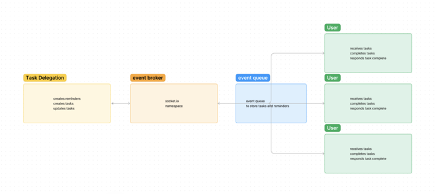

# Task Reminders

**Authors**: Wajiha Khan, Demarquies Jolly, Evan Cheng

**Overview**:

The project is centered around developing a straightforward to-do list application that allows users to manage their tasks efficiently. The key functionalities include adding new tasks, removing existing tasks, marking tasks as complete, and setting reminders for tasks. The application will notify users when a task is due, helping them stay on top of their schedule.

## Features

**Add Tasks**:

- Users can input new tasks into the application.
- Each task entry includes a description and an optional due date/time.

**Remove Tasks**:

- Users can delete tasks that are no longer needed.
- This helps keep the to-do list organized and clutter-free.

**Complete Tasks**:

- Users can mark tasks as complete.
- Completed tasks can be visually distinguished (e.g., struck through or moved to a 'Completed' section).

**Set Reminders**:

- Users can set reminders for each task.
- The reminder will include the due date and time for the task.

**Notifications for Due Tasks**:

- The application will notify users when a task is due.
- Notifications can be implemented using browser notifications or in-app alerts.

## Technologies

**JavaScript**:

- Handle the logic and functionality of the application.
- Use JavaScript to add, remove, and complete tasks.
- Implement reminders and notifications.

**Chance**:

- Use the Chance library for generating random data

**socket.io and socket.io-client**:

- Implement real-time updates and notifications.
- Use socket.io on the server-side and socket.io-client on the client-side for real-time communication.

